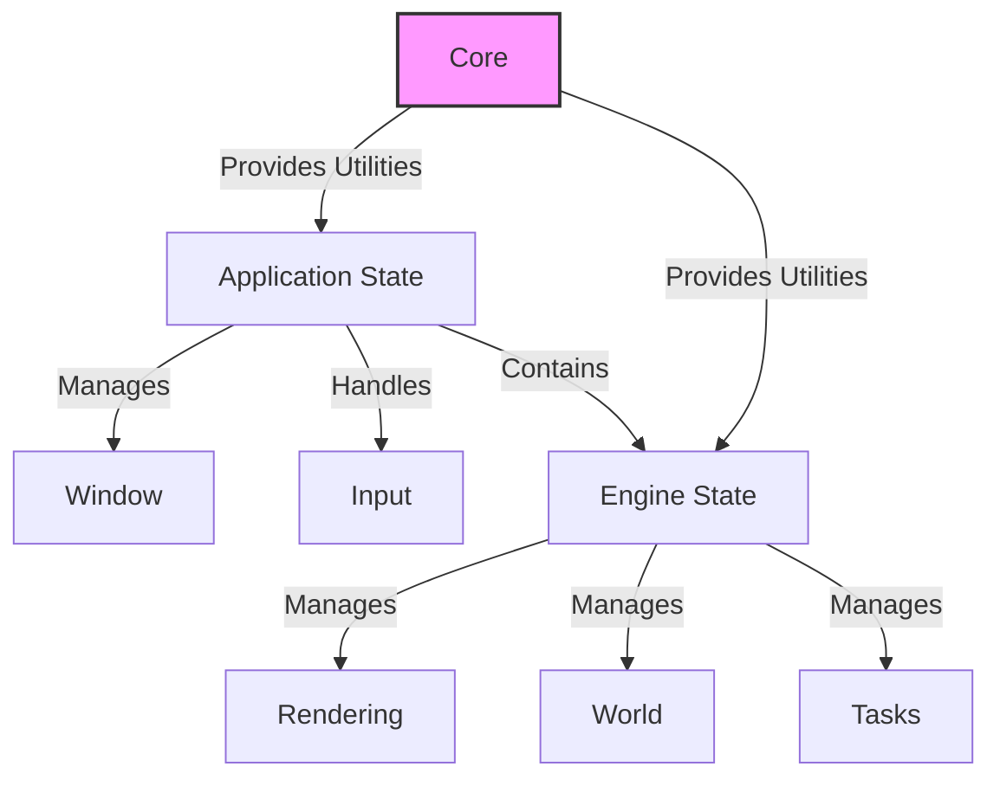

# Voxel Engine Architecture

## Core Principles
1. **Performance First**
   - Optimize for cache locality
   - Minimize allocations in hot paths
   - Parallelize where possible

2. **Modularity**
   - Clear system boundaries
   - Dependency injection
   - Platform-agnostic core

3. **Testability**
   - Pure logic where possible
   - Mockable dependencies
   - Benchmarkable components

## High-Level Architecture

## Key Systems

### Application State
- **Purpose**: Manages the application lifecycle and window management
- **Components**:
  - Window management
  - Input handling
  - Event loop integration
- **Key Files**:
  - `src/application_state/mod.rs`
  - `src/application_state/input_manager.rs`

### Engine State
- **Purpose**: Core game loop and state management
- **Components**:
  - Main game state
  - Camera management
  - System coordination
- **Key Files**:
  - `src/engine_state/mod.rs`
  - `src/engine_state/camera_state/`

### Core Utilities
- **Purpose**: Provides essential building blocks
- **Components**:
  - Thread-safe resources (`MtResource`, `MtSystem`)
  - Single-threaded resources (`StResource`, `StSystem`)
  - Dependency injection system
- **Key Files**:
  - `src/core/mod.rs`
  - `src/core/injection_system.rs`

### Rendering System
- **Purpose**: Handles all graphics rendering
- **Components**:
  - WGPU integration
  - Mesh management
  - Shader pipeline
- **Key Files**:
  - `src/engine_state/rendering/`
  - `src/engine_state/rendering/meshing/`

### World Management
- **Purpose**: Manages game world state
- **Components**:
  - Chunk loading/unloading
  - Voxel data storage
  - World generation
- **Key Files**:
  - `src/engine_state/voxels/`
  - `src/engine_state/voxels/world.rs`

### Task System
- **Purpose**: Manages asynchronous operations
- **Components**:
  - Background processing
  - Resource loading
  - Chunk generation
- **Key Files**:
  - `src/engine_state/task_management/`
  - `src/engine_state/voxels/tasks/`

## Threading Model
- **Main Thread**:
  - Window/Input handling
  - Rendering
  - Game state updates

- **Background Threads**:
  - Chunk generation
  - File I/O
  - Asset loading

## Performance Considerations
- **Memory Management**:
  - Use of arenas for chunk data
  - Object pooling for frequently allocated objects
  - Efficient data structures for spatial queries

- **Rendering**:
  - Frustum culling
  - Level-of-detail (LOD) systems
  - GPU resource pooling

- **Concurrency**:
  - Thread-local storage where appropriate
  - Work-stealing for task scheduling
  - Lock-free algorithms for high-contention paths
